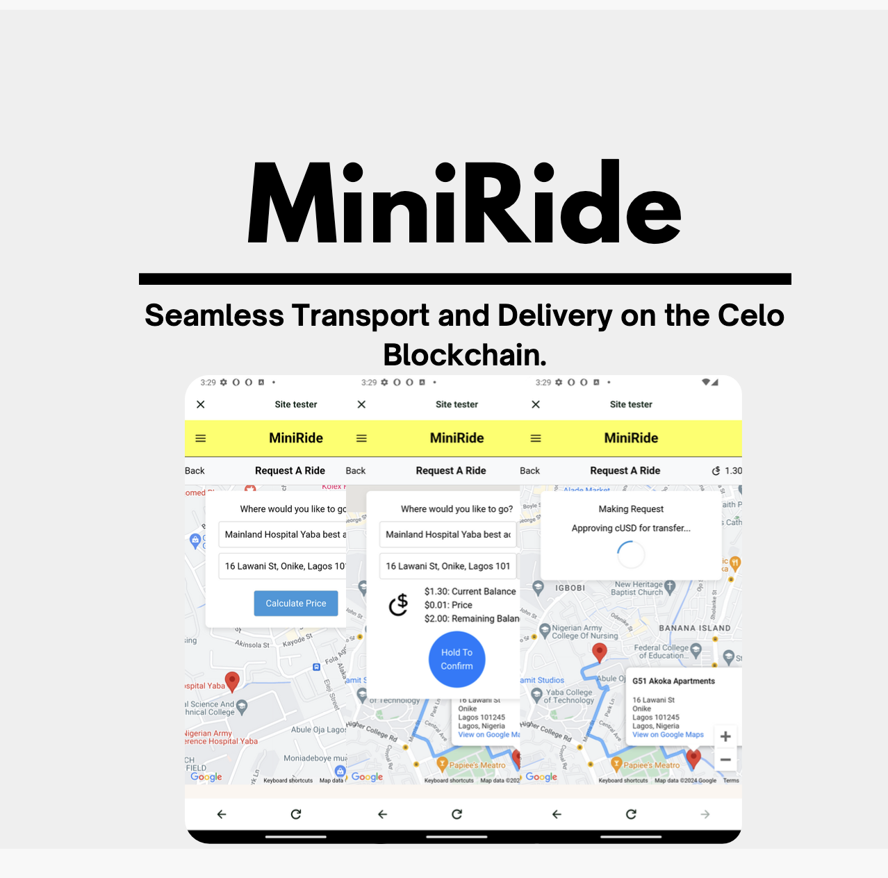

# MiniRide
<!-- TITLE -->

 
  

<!-- TABLE OF CONTENTS -->

## Table of Contents

- [MiniRide](#miniride)
  - [Table of Contents](#table-of-contents)
  - [About](#about)
    - [Problem / Solution](#problem--solution)
    - [How it works](#how-it-works)
      - [Roles](#roles)
      - [Service](#service)
      - [Deliveries](#deliveries)
  - [Features](#features)
  - [Architecture](#architecture)
    - [Front-End Overview](#front-end-overview)
    - [Contract Overview](#contract-overview)
    - [FireBase Overview](#firebase-overview)
  - [Future Impovments](#future-impovments)
  - [Installation](#installation)
    - [Contract Compiling](#contract-compiling)
    - [react-app (Dapp)](#react-app-dapp)
  - [License](#license)

## About

An e-commerce transportation and delivery application that provides MiniPay users with a new type of Web3 experience, offering ride-sharing and delivery services powered by cUSD on the Celo Blockchain.

Video Walkthrough

### Problem / Solution 

In many parts of Africa, reliable transportation and delivery services are scarce, leading to inefficiencies and delays. Traditional payment methods can be cumbersome and insecure, limiting access to essential services. MiniRide addresses these issues by providing a seamless, secure, and efficient platform for ride-sharing and deliveries, leveraging the power of blockchain technology and cryptocurrency.

### How it works

#### Roles

<b>Users / Passengers</b>
- Required to sign in with their Google account for quick onboarding utilizing Celo's Social Connect phone numbers are used for quick onboarding.

<b>Drivers </b>
- Required to sign with thier Google Account via Celo's Social Connect, addiniltiy require to inrole in the driver role, creating a profile in the process.`

<b>Businesses </b>
 - Required to register through the smart contract, digital representing their business on the blockchain.

#### Service 

<b><u>Ride share </b></u>

Both drivers and passengers access the service through the Mini Ride dApp via MiniPay. Drivers must enroll in the service before participating. The user starts the process by selecting their destination on a map and then interacting with a smart contract that facilitates the payment of cUSD. The pickup and dropoff locations are entered into Google Firebase. Firebase pairs the driver and passenger that best match the ride. The driver is notified and required to confirm the request via the smart contract, which also updates the Firebase entry. Once the ride is complete, the driver confirms the completion through the smart contract. The passenger then confirms the completion of the ride, providing a rating and an optional review. The driver interacts with the contract to release the payment for the ride.

#### Deliveries 

Users interact with a map view (Google Maps) displaying businesses that accept cUSD and are registered with MiniRide. Once selected, users can view the online store and the products they sell. The delivery process starts when users purchase a product via a smart contract. The store location and proof of purchase output from the smart contract are entered into Google Firebase. Firebase pairs a driver with the delivery. Once accepted, users can get live location updates of their delivery through the Realtime Database. The driver confirms the completion of the delivery via the smart contract, notifying the user in the process. The user then confirms the completion of the delivery, providing a rating and an optional review. Additionally, users can review the item they purchased from the business, with all records stored on the blockchain. The driver interacts with the contract to release the payment of the delivery.

## Features

- Swift onboarding via social connect with phone number authentication.
- Flexible and supportive multisig escrow functionality.
- Immutable reviews for businesses, ensuring transparency and trust.
- Google Maps API for locations.

## Architecture 

MiniRide consists of three integral elements: Frontend, Smart Contracts, and Firebase. Each plays a crucial role in facilitating the service.

### Front-End Overview

A React-based dApp enables each role to interact with the service. The goal is to provide a quick, simple, and secure user experience. Each party has its own React page, facilitating their respective roles. Both users and drivers utilize the Google Maps API for querying services and selecting locations.

<b>Users</b>

- Requiring users to sign in with their Google Account via phone number provides simplicity and security.

+ Users select between two services (ride, delivery)
  + Ride     : Users select the pickup and drop-off locations by dropping pins on a map view (Google Maps).
  + Delivery : Users pick pins on a map view linked to businesses that accept cUSD cryptocurrency. The link forwards to the business's online store view, allowing users to purchase an item and get live delivery notifications.

<b>Drivers</b>

- Drivers view a list of incoming requests that fit their driving criteria. Drivers have the option to select and fulfill a request.

<b>Business</b>

- Businesses can register on the MiniRide platform, allowing users to discover items for purchase using Minipay.

  
MiniPay Flow Diagram

  

### Contract Overview 

+ Roles
  + <b><u>Business.sol</u></b> : Allows creation and registration of a business.
  + <b><u>Drivers.sol</u></b> : Allows registration of a driver.

<b><u>MultiSig.sol</u></b> : Handles payments of cUSD between two or more parties.

<b><u>OrderManagement.sol</u></b> : Manages and processes request orders (rides, deliveries) and provides proof of purchases (PoP).

<b><u>RatingReputationReviews.sol</u></b> : On-chain management system for rating, reputation, and reviews.

<b><u>TransportAndDelivery.sol</u></b> : Manages user and driver interactions with requests (creation, completion, and cancellations).

[Mainnet Deployed Contract]("https://explorer.celo.org/mainnet/address/0xab1A651D53d9c6B9c5DFEC2b29CDbEeaBA9aa1ac")
  
<b><u>TransportAndDeliveryWithAttestation.sol</u></b> : Manages user and driver interactions with requests with attestations.
  

  

  
Contracts UML Diagram

  

### FireBase Overview

<b><u>Authentican</u></b> : Handles onboarding and logging in of users. Allows for secure entries into Firebase.
  
<b><u>Firebase</u></b> : Storage of user requests, securely linked to user accounts.
  
<b><u>Realtime</u></b> : Updates requests for real-time status updates and location tracking. 

  

  
Web2/Web3 Flow Diagram

  

## Future Impovments

- Rewards and inceatives for drivers and users
- Migrate to EAS

## Installation

### Contract Compiling 

Refer to [hardhat readme](packages/hardhat/README.md)

### react-app (Dapp)

Refer to [react-app readme](packages/react-app/README.md)

## License

Distributed under the Apache License. See `LICENSE.txt` for more information.

